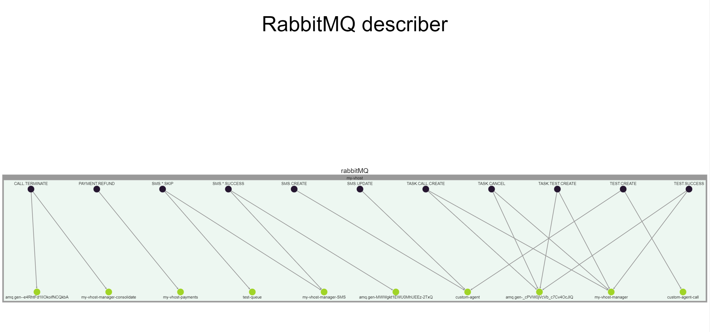

# rabbitmq-describer

> Generates a static page that describes the rabbitMQ behavior in a specific app.

It will show a graph with nodes and links, describing which routing keys are being used and which queues are listening to those routing keys.

Very useful to have a graphical overview of a complex rabbitmq system.

# How it works

It will connect to your rabbitMQ management url (default is `http://localhost:15672`) and get the basic metadata of your queues and routing keys. Then it will display the connections in a graph using [Cytoscape.js](https://js.cytoscape.org/), a graphical lib for visualization in graph theory.

# Use it

Edit the file in config/default.json

```
"rabbitMQConfig": {
    "managementURL": "YOUR_RABBITMQ_MANAGEMENT_URL",
    "user": "YOUR_USER",
    "password": "YOUR_PASSWORD"
  }
```

Run it

```
npm install
npm start
```

Go to [http://localhost:3030/graph](http://localhost:3030/graph)

# Example of the output


